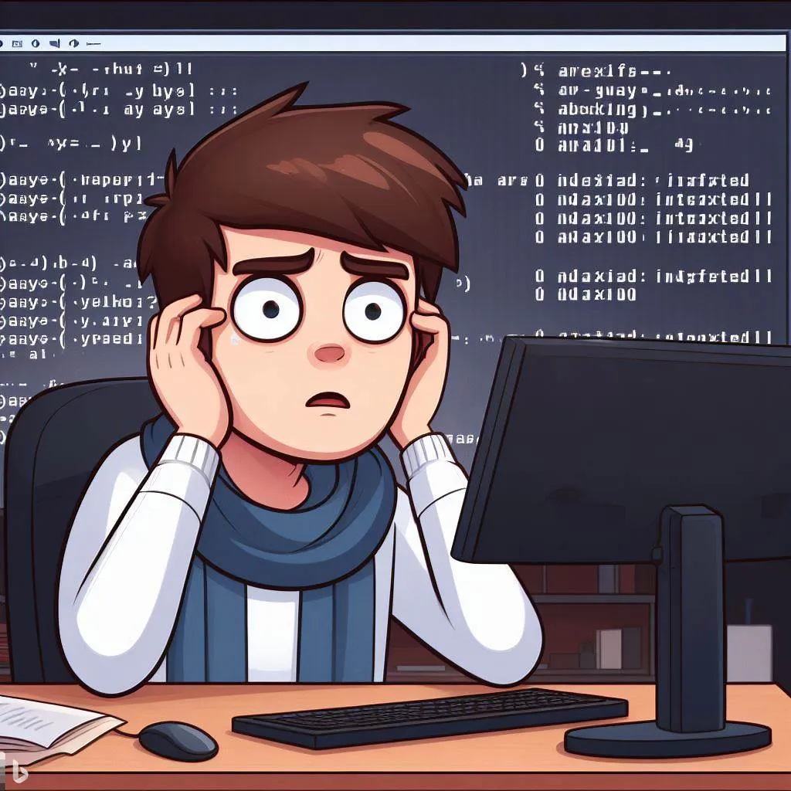
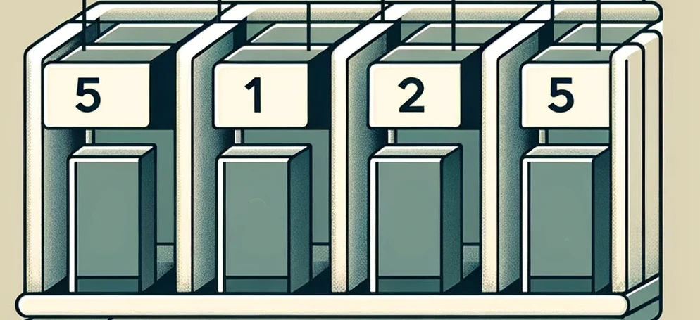

Have you ever wondered why arrays in programming always seem to start at zero? It’s more than just a quirk; it’s a convention deeply rooted in programming of time long past. Let’s peel back the onion on the historical reasonings of how this convention began.

## What is an Array?
An array as defined by Wikipedia is:

> In computer science, an array is a data structure consisting of a collection of elements (values or variables), of same memory size, each identified by at least one array index or key.

Now we are going to try to make or break this definition.

## Manual Memory Management
Let's start by looking at how an array of integers looks inside your system memory, assuming the following contents.

```javascript
[5, 1, 2, 5]
```



The amount of memory used to store a given data type can sometimes vary by
system or architecture, so the boxes are unlabeled. But take note of the following details:

* Each box is the same size
* Each box is directly next to it's preceeding box
* The order of the boxes matches the order of our array as written


## Arrays in High-Level Languages
The following examples are PHP for simplicity sake, but the behavior you will shortly see is generally the same in all high level languages.

```php
$arr = [5, 1, 3, 2];
```

This seems fine.

Each value is the same type and they can all be stored in the same size block of memory. 

But hold on, because this also works.

```php
$arr = [1, "Jody", false];
```

Whoops. Now we have peas in our porride. Booleans are ultimately represented as a one or zero, so this almost works, but "Jody" would need more memory. 

To take it one step further:

```php
$arr = [
    "name" => "Jody",
    "age" => 32,
];
```

PHP calls these associative arrays, but depending on your tool of choice you may recognize that as an object, a dictionary, or a hash map. This is because the arrays in PHP, as they exist in userland, are actually based on an ordered map implementation.

## Arrays in Low-Level Languages
As a conrast, the syntax in C is mostly comparable. But there are nuances.

```c
int ages[] = {32, 36, 41, 42, 45};
```

A few behaviors worth noting:

* We are assigning the type of front and saying "This array will contain only integers". 
* The size is (implicitly) set by the number of items we give it
* The size of each block will be decided by the system using the explicit type

The most important thing discussed so far being, arrays are **contigious** in memory. Always one member, next to the previous until the end. 

## Pointers and Pointer Arithmetic
Depending on your language of choice, it's possible you've never been exposed to a pointer. In short, a pointer is an identifier that "points" 
to a specific location in memory. So when you access `ages` from the code above, you aren't accessing the actual array itsself, but rather
the memory address. The pointer stores in `ages` points and says "The first item of this array is at memory address abc123."

Since you only have the address to the first item, pointer arithmitic is how we find the remainders. This is why it's so critically important that each array
member have the same data type, size, and be contigiously (without a break) expressed in memory.

Pointer arithimic is the process by which take the memory address of the first item and find the next. What we frequently refer to as an "index", ie the Nth item in an array, it's actually more accurate to describe as an offset. Assuming the system this code is running on uses 4 bytes of memory to store an integer, `ages[0]` represents an offset of zero
for the first item. Stepping forward, `ages[1]` represents an offset of 1, so the original pointer address + 4 bytes is where the second item lives in memory. 

## Conclusion
Even though most higher-level languages use another data type like a hash map to represent an array, this convention still applies to almost all languages. 

My personal opinion is that if a languge does not expose a "real" array directly, then "arrays" in those languges should begin with "one", the same way that a list does. But
I know I'm in the minority and it's not a hill I'm willing to die on. 